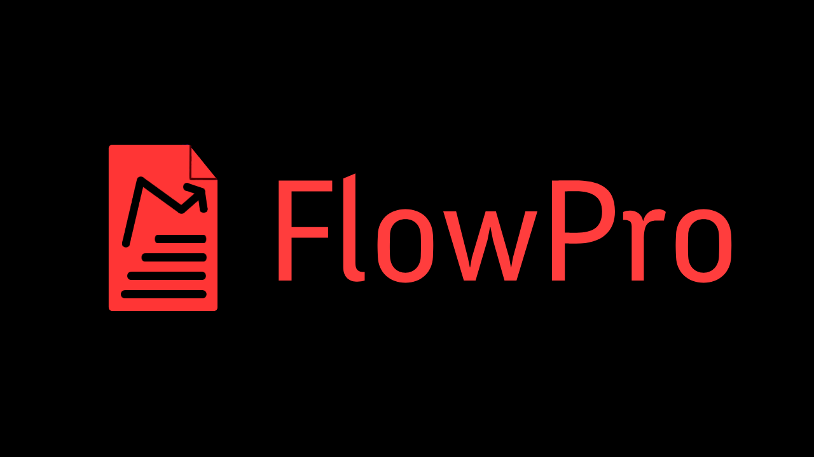

# FlowPro


Welcome to **FlowPro**, a comprehensive web application designed to help you manage your finances effectively. With FlowPro, you can create an account, set budgets, record transactions, and view detailed insights into your spending data, net worth, assets, and even crypto trends/stocks—all within a cohesive and user-friendly dashboard.

## Table of Contents

- [Features](#features)
- [Installation](#installation)
- [Configuration](#configuration)
- [Usage](#usage)
- [Technologies Used](#technologies-used)
- [Contributing](#contributing)
- [License](#license)

## Features

- **User Authentication**: Create an account and log in securely.
- **Budget Management**: Set monthly budgets to keep track of your spending.
- **Transaction Recording**: Note down all your transactions with ease.
- **Spending Insights**: View detailed charts and graphs showing your spending patterns.
- **Net Worth Tracking**: Keep an eye on your net worth and asset values.
- **Crypto Trends**: Monitor the latest trends in cryptocurrency.
- **Stock Monitoring**: Track stocks and view related data.
- **Asset Recording**: Keep track of assets in a visually appealing way.

> Additionally: All data is displayed in a visually appealing fashion with smooth animations 🙂

## Installation

### Prerequisites

Before you begin, ensure you have the following installed on your system:

- [Node.js](https://nodejs.org/) (v12 or higher)
- [npm](https://www.npmjs.com/) or [Yarn](https://yarnpkg.com/)

### Steps

1. Clone the repository:

    ```bash
    git clone https://github.com/yourusername/flowpro.git
    cd flowpro
    ```

2. Install dependencies:

    ```bash
    npm install
    ```

    or

    ```bash
    yarn install
    ```

3. Set up Firebase:

    - Create a project in the [Firebase Console](https://console.firebase.google.com/).
    - Enable Authentication, Firestore, and any other required Firebase services.
    - Obtain your Firebase configuration and set the environment variables as described in the [Configuration](#configuration) section.

4. Start the development server:

    ```bash
    npm run dev
    ```

    or

    ```bash
    yarn dev
    ```

    The app should now be running at `http://localhost:3000`.

## Configuration

Create a `.env` file in the root of your project and add the following environment variables with your Firebase configuration:

```
.env:
NEXT_PUBLIC_FIREBASE_API_KEY=your_firebase_api_key
NEXT_PUBLIC_FIREBASE_AUTH_DOMAIN=your_firebase_auth_domain
NEXT_PUBLIC_FIREBASE_PROJECT_ID=your_firebase_project_id
NEXT_PUBLIC_FIREBASE_STORAGE_BUCKET=your_firebase_storage_bucket
NEXT_PUBLIC_FIREBASE_MESSAGING_SENDER_ID=your_firebase_messaging_sender_id
NEXT_PUBLIC_FIREBASE_APP_ID=your_firebase_app_id
NEXT_PUBLIC_CRYPTOCOMPARE_API_KEY=your_cryptocompare_api_key
NEXT_PUBLIC_JWT_SECRET=your_jwt_secret
```

## Usage

### User Authentication

1. **Sign Up**: Create a new account using your email and password.
2. **Log In**: Access your account using the credentials provided during sign-up.

### Dashboard

Once logged in, you will be taken to your dashboard where you can:

- **Set Budgets**: Define your monthly budget to track spending.
- **Record Transactions**: Add details of your income and expenses.
- **View Insights**: Analyze your spending habits through various charts and graphs.
- **Track Net Worth**: Monitor the value of your assets and liabilities.
- **Crypto Trends**: Stay updated with the latest trends in cryptocurrencies.
- **Stock Data**: Keep an eye on your favorite stocks.

## Technologies Used

- **Frontend**: React, Next.js, Tailwind CSS
- **Backend**: Firebase Authentication, Firebase Firestore
- **Charts and Graphs**: ApexCharts
- **State Management**: React Hooks, Context API
- **Authentication**: JSON Web Tokens (JWT)
- **API**: CryptoCompare API for cryptocurrency data

## Contributing

We welcome contributions from the community! Please follow these steps to contribute:

1. Fork the repository.
2. Create a new branch (`git checkout -b feature/your-feature-name`).
3. Make your changes.
4. Commit your changes (`git commit -m 'Add some feature'`).
5. Push to the branch (`git push origin feature/your-feature-name`).
6. Open a pull request.

## License

This project is licensed under the BSD 3.0-Clause License. See the [LICENSE](https://opensource.org/license/bsd-3-clause) file for more details.

---

Thank you for using **FlowPro**! If you have any questions or need further assistance, feel free to open an issue or contact the developer. Happy budgeting!